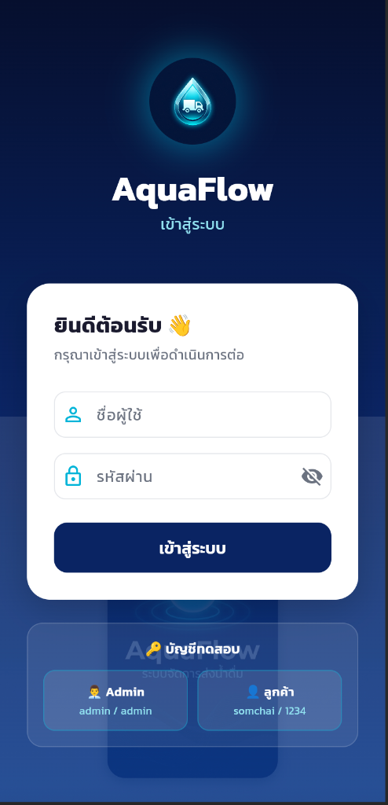
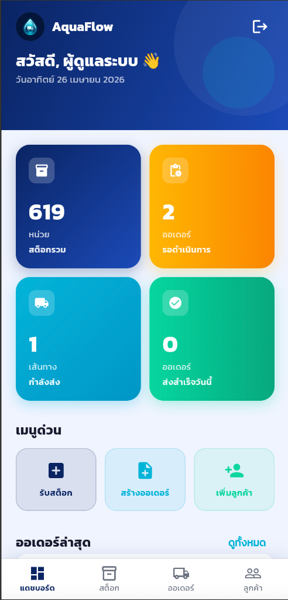
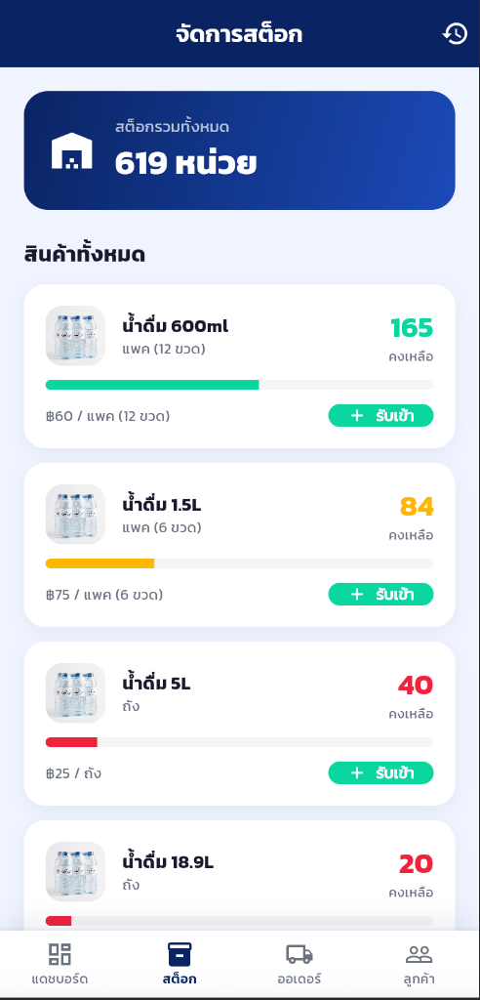
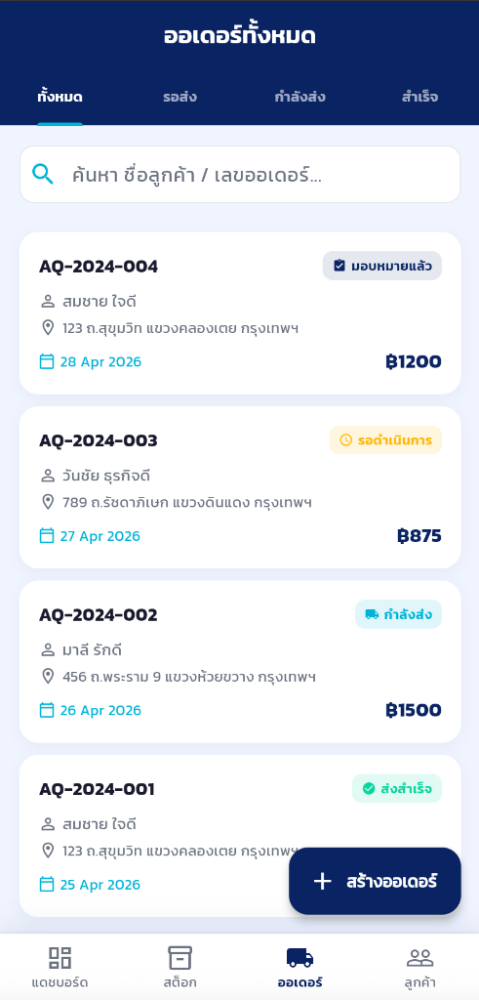
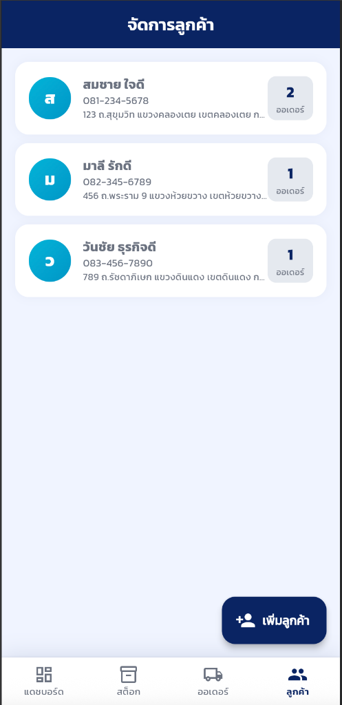

# 💧 AquaFlow Delivery 


AquaFlow เป็นแอปพลิเคชันระบบจัดการและติดตามการจัดส่งน้ำดื่ม ที่พัฒนาด้วย **Flutter** และใช้ **Supabase** เป็นระบบ Backend ครบวงจร (Database, Authentication, Storage) ออกแบบมาให้มี UI ที่ทันสมัย ใช้งานง่าย และรองรับระบบผู้ใช้งาน 2 ระดับคือ **Admin** (แอดมิน) และ **Customer** (ลูกค้า)

---

## 📱 ภาพหน้าจอแอปพลิเคชัน (Screenshots)

<div align="center">
  
  
  
  
  
</div>

---

## ✨ ฟีเจอร์หลัก (Features)

### 👨‍💼 สำหรับผู้ดูแลระบบ (Admin)
* **ระบบจัดการสต็อก (Stock Management):** เพิ่มและติดตามจำนวนน้ำดื่มแบบ Real-time พร้อมประวัติการเข้า-ออก
* **ระบบจัดการออเดอร์ (Order Management):** สร้างออเดอร์ใหม่, ดูรายการสั่งซื้อ, และอัปเดตสถานะการจัดส่ง
* **อัปโหลดหลักฐานการส่ง (Delivery Proof):** ถ่ายภาพหรือเลือกรูปภาพหลักฐานการจัดส่ง อัปโหลดขึ้น Supabase Storage แบบเรียลไทม์
* **Dashboard อัจฉริยะ:** สรุปยอดออเดอร์และสถานะแบบกราฟิกสวยงาม

### 🙋‍♂️ สำหรับลูกค้า (Customer)
* **หน้า Dashboard ส่วนตัว:** ดูภาพรวมและสถานะการจัดส่งของตัวเอง
* **ประวัติการสั่งซื้อ (Order History):** ตรวจสอบประวัติการส่งน้ำดื่มย้อนหลัง
* **ติดตามสถานะ (Order Tracking):** ตรวจสอบว่าสินค้ากำลังจัดส่ง หรือจัดส่งสำเร็จแล้ว พร้อมดูรูปถ่ายหลักฐาน

---

## 🛠️ เทคโนโลยีที่ใช้ (Tech Stack)

* **Frontend:** Flutter (Dart)
* **Backend:** Supabase (PostgreSQL Database, Storage)
* **State Management:** Provider
* **Routing:** Go Router
* **UI/UX:** Google Fonts (Prompt), Flutter Animate, Custom Glassmorphism UI

---

## 🚀 เริ่มต้นใช้งาน (Getting Started)

### 1. การติดตั้ง
1. Clone โปรเจกต์ลงมาที่เครื่อง
   ```bash
   git clone https://github.com/Tnim657722/flutter_water.git
   ```
2. โหลด Dependencies
   ```bash
   flutter pub get
   ```

### 2. การเชื่อมต่อ Supabase
โปรเจกต์นี้ตั้งค่ารหัส API และ Endpoint ของ Supabase ไว้ใน `lib/main.dart` เรียบร้อยแล้ว หากต้องการเปลี่ยนไปใช้ Database ของตัวเอง ให้เปลี่ยนค่าเหล่านี้:
```dart
const String supabaseUrl = 'YOUR_SUPABASE_URL';
const String supabaseAnonKey = 'YOUR_SUPABASE_ANON_KEY';
```

### 3. รันแอปพลิเคชัน
รันคำสั่งด้านล่างเพื่อเปิดแอปพลิเคชัน:
```bash
flutter run
```

---

## 🔑 บัญชีสำหรับทดสอบ (Demo Accounts)

สามารถใช้ข้อมูลเหล่านี้เพื่อทดสอบการเข้าสู่ระบบ:

**1. ผู้ดูแลระบบ (Admin)**
* ชื่อผู้ใช้: `admin`
* รหัสผ่าน: `admin`

**2. ลูกค้า (Customer)**
* ชื่อผู้ใช้: `somchai`, `malee`, หรือ `wanchai`
* รหัสผ่าน: `1234`

---

## 📦 โครงสร้างฐานข้อมูล (Database Schema)
* `users` - เก็บข้อมูลผู้ใช้งาน
* `products` - เก็บรายการสินค้า (น้ำดื่มขนาดต่างๆ)
* `stock_transactions` - ประวัติการนำเข้า-ส่งออกสินค้า
* `orders` - รายการสั่งซื้อหลัก
* `order_items` - รายละเอียดสินค้าในแต่ละออเดอร์

---
*พัฒนาเพื่อส่งเป็นมินิโปรเจกต์ (Mini Project)*
